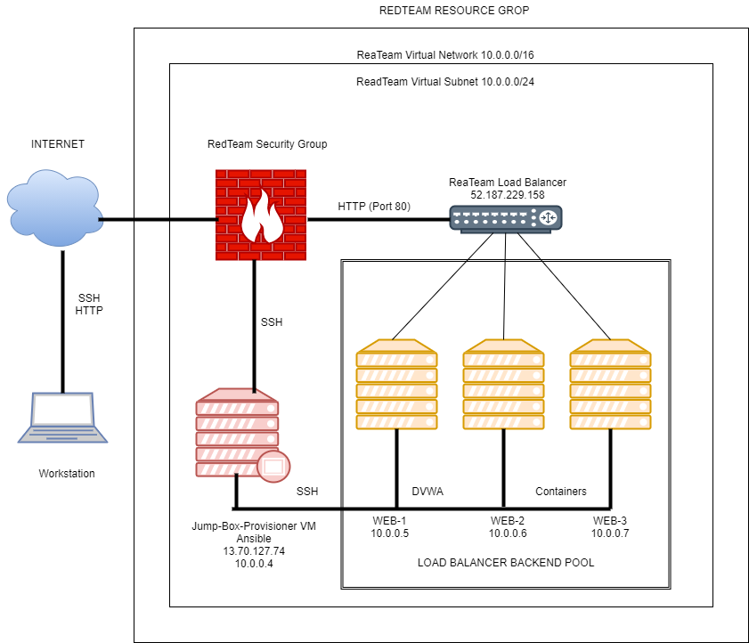
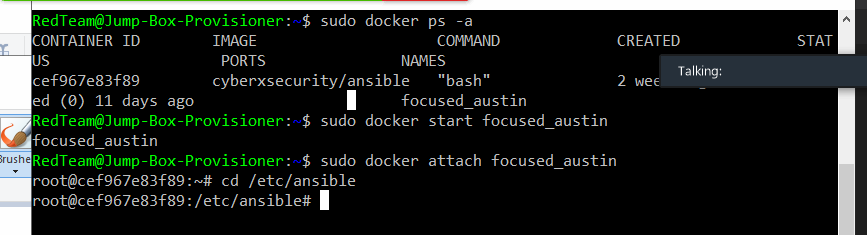

## Automated ELK Stack Deployment

The files in this repository were used to configure the network depicted below.

These files have been tested and used to generate a live ELK deployment on Azure. They can be used to either recreate the entire deployment pictured above. Alternatively, select portions of the Yaml file may be used to install only certain pieces of it, such as Filebeat.

[Click to open Filebeat](Images/filebeat-playbook.yml)

This document contains the following details:
- Description of the Topologu
- Access Policies
- ELK Configuration
  - Beats in Use
  - Machines Being Monitored
- How to Use the Ansible Build

### Description of the Topology

The main purpose of this network is to expose a load-balanced and monitored instance of DVWA, the D*mn Vulnerable Web Application.

Load balancing ensures that the application will be highly available, in addition to restricting traffic to the network.
- Mitigate DoS attacks by evenly distribute traffic among the servers: What aspect of security do load balancers protect? What is the advantage of a jump box? You can use Jump box to create Ansible file to serve all the dockers.

Integrating an ELK server allows users to easily monitor the vulnerable VMs for changes to the traffic and system files.
- Filebeat watch for system logs : What does Filebeat watch for?
- Metricbeat watch for machine metrics: What does Metricbeat record?

The configuration details of each machine may be found below.
_Note: Use the [Markdown Table Generator](http://www.tablesgenerator.com/markdown_tables) to add/remove values from the table_.

| Name     | Function | IP Address | Operating System |
|----------|----------|------------|------------------|
| Jump Box | Gateway  | 10.0.0.4   | Linux            |
| WEB-1    | DVWA     | 10.0.0.5   | Linux            |
| WEB-2    | DVWA     | 10.0.0.6   | Linux            |
| ELK      |Review Logs|10.1.0.4   | Linux            |
### Access Policies

The machines on the internal network are not exposed to the public Internet. 

Only the Elk and the Jump box machine can accept connections from the Internet. Access to this machine is only allowed from the following IP addresses:
49.193.250.126 Add whitelisted IP addresses

Machines within the network can only be accessed by Jump Box.
- Jump Box : Which machine did you allow to access your ELK VM? What was its IP address? 13.70.127.74

A summary of the access policies in place can be found in the table below.

| Name     | Publicly Accessible | Allowed IP Addresses |
|----------|---------------------|----------------------|
| Jump Box | Yes                 | 49.193.250.126       |
|  WEB-1   | No                  | 10.0.0.1-254         |
|  WEB-2   | No                  | 10.0.0.1-254         |
|  ELK     | No                  | 10.1.0.4             |

### Elk Configuration

Ansible was used to automate configuration of the ELK machine. No configuration was performed manually, which is advantageous because...
- : What is the main advantage of automating configuration with Ansible?_It does automation and increase effeciency when building a network

The playbook implements the following tasks:
- : In 3-5 bullets, explain the steps of the ELK installation play. E.g., install Docker; download image; etc._
Before we can run Elk VM we increase the memory to meet the Elk requirements, then we install the playbook to have automated configuration file, then we install the docker engine use for running the containers and finally download the image to have our docker image saved. 

...
  - name: Install apache httpd
      apt:
      name: apache2
      state: absent 

  - name: Install docker.io
      apt:
      update-cache:yes 
      name: docker.io
      state: present
  
  - name: Install pip3
      apt:
      name: python3-pip
      state: present
  
  - name: Install python docker module
     pip:
     name: docker
     state:present
  
  - name: downlaod and lanch a docker web container
    docker-container:
    name: dvwa
    image: cyberxsecurity
    state: started

     # Use command module
  - name: Increase virtual memory
      command: sysctl -w vm.max_map_count=26214

     # Use sysctl module
  - name: Use more memory
      sysctl:
        name: vm.max_map_count
        value: "262144"
        state: present
        reload: yes

   # Use docker_container module
  - name: download and launch a docker elk container
      docker_container:
        name: elk
        image: sebp/elk:761
        state: started
        restart_policy: always
        published_ports:
          - 5601:5601
          - 9200:9200
          - 5044:5044

       

The following screenshot displays the result of running `docker ps` after successfully configuring the ELK instance.

### Target Machines & Beats
This ELK server is configured to monitor the following machines: WEB-1 and WEB-2
- : List the IP addresses of the machines you are monitoring_ 10.0.0.5 and 10.0.0.6

We have installed the following Beats on these machines:
- : Specify which Beats you successfully installed_Filebeat and Metricbeat

These Beats allow us to collect the following information from each machine:
-  : In 1-2 sentences, explain what kind of data each beat collects, and provide 1 example of what you expect to see. E.g., `Winlogbeat` collects Windows logs, which we use to track user logon events, etc._Filebeat reads and ships system logfiles such as hardware events and application logs. Metricbeat reads metric data such as CPU usage, memory, disk usage and network statistic.

### Using the Playbook
In order to use the playbook, you will need to have an Ansible control node already configured. Assuming you have such a control node provisioned: 

SSH into the control node and follow the steps below:
- Copy the playbook file to Ansible Control node.
- Update the YAML file to include the webserver and the Elk.
- Run the playbook, and navigate to DVWAs and the Elk to check that the installation worked as expected.

_ Answer the following questions to fill in the blanks:_
- _Which file is the playbook? Install_Elk.yml Where do you copy it?_In the Ansible Control Node
- _Which file do you update to make Ansible run the playbook on a specific machine? /etc/ansible.conf How do I specify which machine to install the ELK server on versus which to install Filebeat on?_ I put the IP's of the webservers in host under [webserver] and of elk under [elk].
install the ELK server :

- _Which URL do you navigate to in order to check that the ELK server is running? http://52.148.92.73:56001/app/kibana

_As a **Bonus**, provide the specific commands the user will need to run to download the playbook, update the files, etc._
ansible-playbook install_elk.yml elk
ansible-playbook install_filebeat.yml webservers
ansible-playbook install_metricbeat.yml webservers